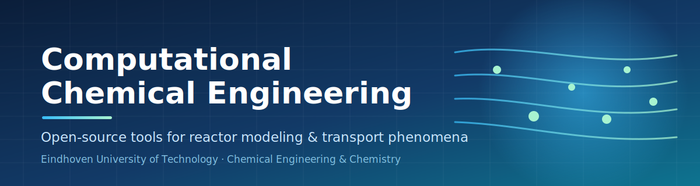
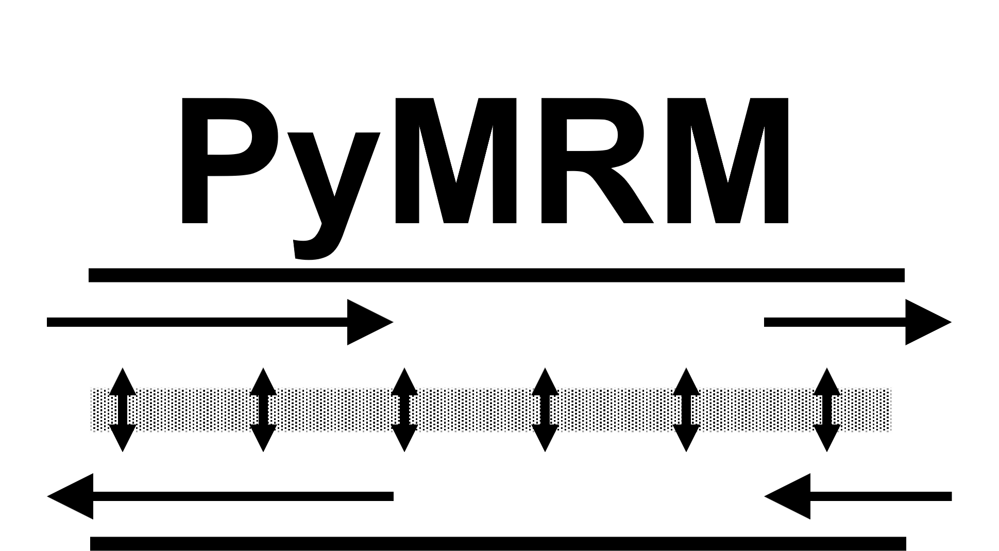
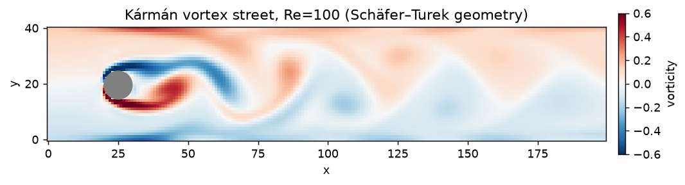
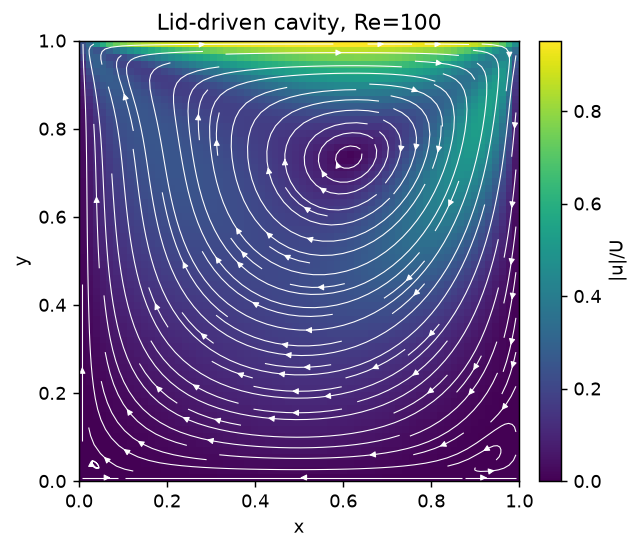

<!-- Organization profile README — rendered on https://github.com/computational-chemical-engineering -->

 

---

## 👋 Welcome

**Computational Chemical Engineering** develops **open, reusable software for modeling chemical
reactors and the transport phenomena that govern them** — from mass transfer and reaction in
multiphase reactors to fluid flow, particle packing, and diffusion at the pore scale.

Our tools grow out of research and teaching in the
[**Chemical Engineering & Chemistry**](https://www.tue.nl/en/) department at
**Eindhoven University of Technology (TU/e)**, led by
[**Frank Peters**](https://www.tue.nl/en/research/researchers/frank-peters). His work centres on the
modeling and simulation of (multiphase) reactors and transport phenomena — the same themes that shape
everything you find here. Everything is released under permissive open-source licenses so that
students, researchers, and engineers can learn from it, build on it, and contribute back.

> **Two active flagship projects** anchor the organization today:
> [**pymrm**](#-pymrm--python-multiphase-reactor-modeling) for reactor-scale modeling, and
> [**Peclet**](#-peclet--gpu-accelerated-transport-phenomena) for high-performance transport-phenomena
> simulation. Each ships with a companion project — a *book* and an *examples gallery* — so you can go
> from first principles to running code.

---

## 🧪 pymrm — Python Multiphase Reactor Modeling

<table>
<tr>
<td width="55%" valign="top">

**What it is.** [`pymrm`](https://github.com/computational-chemical-engineering/pymrm) is a Python
package for building and solving **multiphase reactor models**. Born as a Matlab toolset for the
*Multiphase Reactor Modeling* course at TU/e, it has been reborn as an open, Python-native library.

**The aim.** Make reactor modeling **approachable without sacrificing rigor** — give students and
practitioners composable building blocks for **diffusion, convection, reaction, and mass transfer**,
assembled into sparse discretized systems that are easy to read, extend, and trust.

**Highlights**
- 🧩 Building blocks for diffusion · convection · reaction · mass transfer
- 🧮 Sparse finite-volume construction with boundary-condition helpers
- 🎓 Tutorial- and example-driven, built for teaching *and* research
- 📦 One-line install: `pip install pymrm`

**Learn it — the [pymrm-book](https://github.com/computational-chemical-engineering/pymrm-book).**
A companion **Jupyter Book** that walks through the theory and the package hands-on.
📖 Read it online: **https://computational-chemical-engineering.github.io/pymrm-book**

</td>
<td width="45%" valign="top" align="center">

The PyMRM logo, from the <a href="https://computational-chemical-engineering.github.io/pymrm-book">pymrm-book</a>.

</td>
</tr>
</table>

[**Repository**](https://github.com/computational-chemical-engineering/pymrm) ·
[**Book**](https://github.com/computational-chemical-engineering/pymrm-book) ·
[**Documentation**](https://computational-chemical-engineering.github.io/pymrm-book) ·
[**PyPI**](https://pypi.org/project/pymrm/)

---

## 🌀 Peclet — GPU-accelerated Transport Phenomena

 
Kármán vortex street behind a cylinder (Re&nbsp;=&nbsp;100), computed with Peclet — from <a href="https://computational-chemical-engineering.github.io/peclet-examples">peclet-examples</a>.

<table>
<tr>
<td width="45%" valign="top" align="center">

Lid-driven cavity (Re&nbsp;=&nbsp;100), a worked example from <a href="https://computational-chemical-engineering.github.io/peclet-examples">peclet-examples</a>.

</td>
<td width="55%" valign="top">

**What it is.** [**Peclet**](https://github.com/computational-chemical-engineering/peclet) is a suite of
codes for **simulating transport phenomena** — Eulerian **CFD** (incompressible Navier–Stokes),
Lagrangian **DEM** (particle packing), and mixed **Voronoi** methods — sharing one MPI **block domain
decomposition**, **signed-distance-field** geometry, a common **immersed-boundary** methodology, **GPU**
support, and **Python bindings**.

**The aim.** Provide a **portable, high-performance foundation** for pore- and particle-scale transport,
where the same source runs multi-threaded on a laptop or across GPUs (CUDA / HIP) on a supercomputer.
The name nods to the [**Péclet number**](https://en.wikipedia.org/wiki/P%C3%A9clet_number) — the ratio
of advection to diffusion at the dimensionless heart of transport phenomena.

**Highlights**
- 🌊 CFD · 🧱 DEM · 🔷 Voronoi on a shared Kokkos + block-decomposition core
- ⚡ GPU (CUDA/HIP) and multi-rank MPI; multi-core wheels via `pip install peclet`
- 🧊 Cut-cell immersed boundaries over SDF-described solids
- 🐍 Unified `peclet.*` Python namespace

**See it work — [peclet-examples](https://github.com/computational-chemical-engineering/peclet-examples).**
A gallery of **runnable, reproducible** worked examples (channel MMS, cut-cell Poiseuille, packed-bed
permeability, and more).
📖 Browse it: **https://computational-chemical-engineering.github.io/peclet-examples**

</td>
</tr>
</table>

[**Repository**](https://github.com/computational-chemical-engineering/peclet) ·
[**Examples**](https://github.com/computational-chemical-engineering/peclet-examples) ·
[**Documentation**](https://computational-chemical-engineering.github.io/peclet/) ·
[**PyPI**](https://pypi.org/project/peclet/)

---

## 🧭 Explore the organization

| Project | What it does | Links |
|---|---|---|
| **pymrm** | Python multiphase reactor modeling — diffusion, convection, reaction, mass transfer | [repo](https://github.com/computational-chemical-engineering/pymrm) · [PyPI](https://pypi.org/project/pymrm/) |
| **pymrm-book** | Companion Jupyter Book: theory + hands-on tutorials for pymrm | [repo](https://github.com/computational-chemical-engineering/pymrm-book) · [site](https://computational-chemical-engineering.github.io/pymrm-book) |
| **peclet** | Umbrella suite for GPU/MPI transport-phenomena simulation (CFD · DEM · Voronoi) | [repo](https://github.com/computational-chemical-engineering/peclet) · [PyPI](https://pypi.org/project/peclet/) |
| **peclet-examples** | Runnable, reproducible worked examples for the Peclet suite | [repo](https://github.com/computational-chemical-engineering/peclet-examples) · [site](https://computational-chemical-engineering.github.io/peclet-examples) |

The Peclet suite is modular — `peclet-core`, `peclet-flow`, `peclet-dem`, `peclet-voro`, and
`peclet-morton` each live in their own repository. Browse them all from the
[**organization page**](https://github.com/orgs/computational-chemical-engineering/repositories).

---

## 🤝 Get involved

- ⭐ **Star** the projects you find useful — it helps others discover them.
- 🐛 **Open an issue** to report bugs or request features.
- 🔧 **Contribute** — pull requests are welcome; see each repository's `CONTRIBUTING` guide.
- 🎓 **Learn** — start with the [pymrm-book](https://computational-chemical-engineering.github.io/pymrm-book) or the [peclet-examples gallery](https://computational-chemical-engineering.github.io/peclet-examples).

 
Built with ❤️ for open, reproducible chemical-engineering research at
<a href="https://www.tue.nl/en/">Eindhoven University of Technology</a>.

